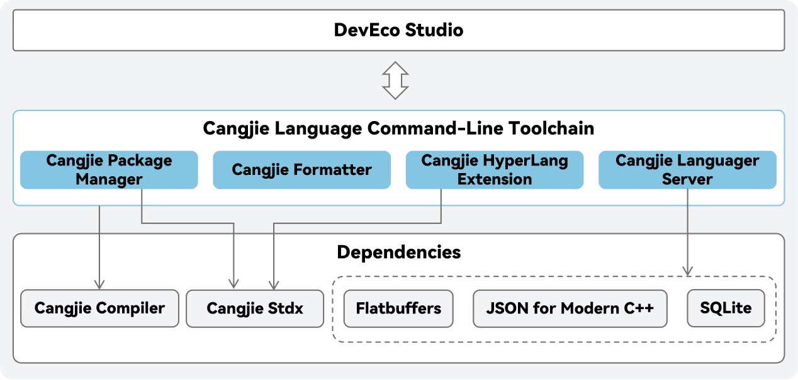

# Cangjie Language Command Line Toolchain

## Introduction

This warehouse provides the Cangjie language command-line toolchain, which includes project management tools, formatting tools, multilingual bridging tools, and language service tools, etc. Developers can use it through the command line or integrate it into DevEco Studio.

## System Architecture

The overall architecture diagram of the Cangjie toolchain is as follows:



As shown in the diagram, this warehouse provides the following cangjie tools:

- Cangjie Project Manager （Abbreviated as `cjpm`）：used for managing the module system of Cangjie project, covering module initialization, dependency checking and updating operations, providing a unified compilation entry point, supporting incremental compilation, parallel compilation, etc.
- Cangjie Formatter （Abbreviated as `cjfmt`）: a code automatic formatting tool developed based on the Cangjie programming specification.
- Cangjie HyperLang Extension （Abbreviated as `hle`）: cangjie calls the template auto generation tool for ArkTS interoperability code.
- Cangjie Languager Server （Abbreviated as `lsp`）: the server backend that provides Cangjie language services on the DevEco Studio needs to be used in conjunction with the DevEco Studio client.
- Cangjie Lint Tool (abbreviated as `cjlint`): A static analysis tool developed based on the Cangjie language coding standards. It helps developers identify issues that violate coding conventions, detect vulnerabilities in code, and write compliant Cangjie code.
- Cangjie Coverage Tool (abbreviated as `cjcov`): A code coverage tool developed based on the Cangjie language programming standards.
- Cangjie Exception Stack Trace Recovery Tool (referred to as `cjtrace-recover`): Assists developers in restoring obfuscated exception stack trace information, enabling better issue localization and root cause analysis.

Cangjie Language CLI Toolchain currently supports the following platforms: Windows x86-64, Linux x86-64/AArch64, Mac x86/arm64. OpenHarmony platform is under development.

## Directory Structure

```
.
├── cangjie-language-server
│   ├── build                 # build script
│   ├── doc                   # construction and usage guidelines
│   └── src                   # source code
├── cjcov
│   ├── build    # build script
│   ├── doc      # construction and usage guidelines
│   └── src      # source code
├── cjfmt
│   ├── build    # build script
│   ├── config   # configuration file
│   ├── doc      # construction and usage guidelines
│   ├── include  # configuration file
│   └── src      # source code
├── cjlint
│   ├── build    # build script
│   ├── config   # configuration file
│   ├── doc      # construction and usage guidelines
│   └── src      # source code
├── cjpm
│   ├── build    # build script
│   ├── doc      # construction and usage guidelines
│   └── src      # source code
├── cjtrace-recover
│   ├── build    # build script
│   ├── doc      # construction and usage guidelines
│   └── src      # source code
└── hyperlangExtension
    ├── build            # build script
    ├── doc              # construction and usage guidelines
    └── src              # source code
```

To get detailed information, please refer to the user guides in the corresponding doc directory.

Please refer to the following software architecture diagrams for the command-line tools:

- [software architecture diagram for `cjpm`](./cjpm/doc/developer_guide.md#开源项目介绍)
- [software architecture diagram for `cjfmt`](./cjfmt/doc/developer_guide.md#开源项目介绍)
- [software architecture diagram for `hle`](./hyperlangExtension/doc/developer_guide.md#开源项目介绍)
- [software architecture diagram for `lsp`](./cangjie-language-server/doc/developer_guide.md#开源项目介绍)
- [software architecture diagram for `cjcov`](./cjcov/doc/developer_guide_zh.md#开源项目介绍)
- [software architecture diagram for `cjlint`](./cjlint/doc/developer_guide_zh.md#开源项目介绍)
- [software architecture diagram for `cjtrace-recover`](./cjtrace-recover/doc/developer_guide_zh.md#开源项目介绍)

## Construction Dependencies

The construction of tools relies on Cangjie `SDK`. Please refer to [Openharmony SDK Integration Construction Guide](https://gitcode.com/Cangjie/cangjie_build/blob/dev/README.md)

## Related Repositories

- [cangjie_docs](https://gitcode.com/Cangjie/cangjie_docs/tree/main/docs/dev-guide)
- [cangjie_compiler](https://gitcode.com/Cangjie/cangjie_compiler)
- [cangjie_stdx](https://gitcode.com/Cangjie/cangjie_stdx)
- [cangjie_build](https://gitcode.com/Cangjie/cangjie_build)
- [cangjie_test](https://gitcode.com/Cangjie/cangjie_test)

## Open Source License

This project is licensed under [Apache-2.0 with Runtime Library Exception](./LICENSE). Please enjoy and participate in open source freely.

## Open Source Software Statement

| Software Name        | License             | Usage Description                                               | Main Component | Usage Method                               |
|----------------------|---------------------|-----------------------------------------------------------------|----------------|--------------------------------------------|
| flatbuffers          | Apache License V2.0 | Cangjie Language Server serializes and deserializes index data. | LSPServer      | Integrated into the Cangjie binary release |
| JSON for Modern C++  | MIT License         | Cangjie Language Server for message parsing and encapsulation.  | LSPServer, cjlint      | Integrated into the Cangjie binary release |
| SQLite               | Public Domain       | Cangjie Language Server uses the database to store index data.  | LSPServer      | Integrated into the Cangjie binary release |

For build methods, refer to the [Openharmony SDK Integration Build Guide](). For additional software dependencies, see [Environment Preparation](). For details on third-party dependencies, see the [Third-Party Open Source Software Documentation](./third_party/README.md)

## Contribution

We welcome contributions from developers in any form, including but not limited to code, documentation, issues, and more.