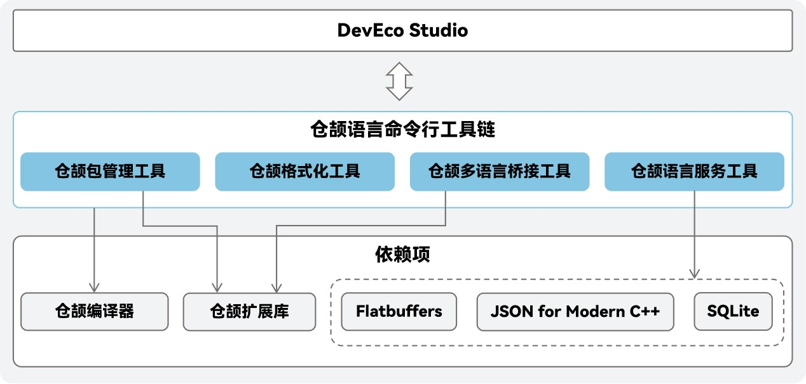

# 仓颉语言命令行工具链

## 简介

本仓提供仓颉语言命令行工具链，包含项目管理工具、格式化工具、多语言桥接工具和语言服务工具等。开发者可以通过命令行使用，也可以集成到DevEco Studio使用。

## 系统架构

仓颉工具链的整体架构图为：



如架构图所示，本仓库提供了下述的仓颉工具：

- 仓颉项目管理工具 （简称 `cjpm`）：用于对仓颉项目模块系统进行管理，涵盖模块初始化、依赖检查与更新等操作，提供统一的编译入口，支持增量编译、并行编译等。
- 仓颉格式化工具 （`cangjie formatter`，简称 `cjfmt`）：基于仓颉语言编程规范开发的代码自动格式化工具。
- 仓颉多语言桥接工具 （`HyperlangExtension`，简称 `hle`）：仓颉调用ArkTS互操作代码的模板自动生成工具。
- 仓颉语言服务工具 （`cangjie language server`，简称 `lsp`）：在DevEco Studio上提供仓颉语言服务的服务器后端，需要搭配DevEco Studio客户端使用。
- 仓颉静态检查工具（简称 `cjlint`）：基于仓颉语言编程规范开发的静态检查工具，通过它可以识别代码中不符合编程规范的问题，帮助开发者发现代码中的漏洞，写出满足要求的仓颉代码。
- 仓颉覆盖率工具（简称 `cjcov`）：基于仓颉语言编程规范开发的代码覆盖率工具。
- 仓颉异常堆栈信息还原工具（简称 `cjtrace-recover`）：帮助开发者还原混淆过的异常堆栈信息，从而更好地定位和排查问题原因。

仓颉语言命令行工具链当前支持在如下平台运行：Windows x86-64、Linux x86-64/AArch64、Mac x86/arm64，鸿蒙平台正在开发中。

## 目录结构

```
.
├── cangjie-language-server
│   ├── build                 # 构建脚本
│   ├── doc                   # 构建指南和使用指南
│   └── src                   # 源码
├── cjcov
│   ├── build                 # 构建脚本
│   ├── doc                   # 构建指南和使用指南
│   └── src                   # 源码
├── cjfmt
│   ├── build    # 构建脚本
│   ├── config   # 配置文件
│   ├── doc      # 构建指南和使用指南
│   ├── include  # 头文件
│   └── src      # 源码
├── cjlint
│   ├── build    # 构建脚本
│   ├── config   # 配置文件
│   ├── doc      # 构建指南和使用指南
│   └── src      # 源码
├── cjpm
│   ├── build    # 构建脚本
│   ├── doc      # 构建指南和使用指南
│   └── src      # 源码
├── cjtrace-recover
│   ├── build                 # 构建脚本
│   ├── doc                   # 构建指南和使用指南
│   └── src                   # 源码
└── hyperlangExtension
    ├── build            # 构建脚本
    ├── doc              # 构建指南和使用指南
    └── src              # 源码
```

若想获取工具的详细信息，请参阅各工具 `doc` 目录下的用户指南。

每个工具对应的软件架构图请参考：

- [`cjpm` 软件架构图](./cjpm/doc/developer_guide_zh.md#开源项目介绍)
- [`cjfmt` 软件架构图](./cjfmt/doc/developer_guide_zh.md#开源项目介绍)
- [`hle` 软件架构图](./hyperlangExtension/doc/developer_guide_zh.md#开源项目介绍)
- [`lsp` 系统架构图](./cangjie-language-server/doc/developer_guide_zh.md#开源项目介绍)
- [`cjcov` 系统架构图](./cjcov/doc/developer_guide_zh.md#开源项目介绍)
- [`cjlint` 系统架构图](./cjlint/doc/developer_guide_zh.md#开源项目介绍)
- [`cjtrace-recover` 系统架构图](./cjtrace-recover/doc/developer_guide_zh.md#开源项目介绍)

## 构建依赖

命令行工具构建依赖于仓颉 `SDK`，请参考[仓颉 SDK 集成构建指南](https://gitcode.com/Cangjie/cangjie_build/blob/dev/README_zh.md)

## 开源协议

本项目基于 [Apache-2.0 with Runtime Library Exception](./LICENSE)，请自由地享受和参与开源。

## 相关仓

- [cangjie_docs](https://gitcode.com/Cangjie/cangjie_docs/tree/main/docs/dev-guide)
- [cangjie_compiler](https://gitcode.com/Cangjie/cangjie_compiler)
- [cangjie_stdx](https://gitcode.com/Cangjie/cangjie_stdx)
- [cangjie_build](https://gitcode.com/Cangjie/cangjie_build)
- [cangjie_test](https://gitcode.com/Cangjie/cangjie_test)

## 使用的开源软件声明

| 开源软件名称               | 开源许可协议              | 使用说明                  | 使用主体 | 使用方式         |
|----------------------|---------------------|-----------------------|------|--------------|
| flatbuffers          | Apache License V2.0 | 仓颉语言服务对索引数据进行序列化和反序列化 | 语言服务 | 集成到仓颉二进制发布包中 |
| JSON for Modern C++  | MIT License         | 仓颉语言服务用于报文解析和封装       | 语言服务、静态检查 | 集成到仓颉二进制发布包中 |
| SQLite               | Public Domain       | 仓颉语言服务使用数据库存储索引数据     | 语言服务 | 集成到仓颉二进制发布包中 |

构建方式参见[仓颉SDK集成构建指导书](https://gitcode.com/Cangjie/cangjie_build/blob/dev/README_zh.md)。更多软件依赖，参见[环境准备](https://gitcode.com/Cangjie/cangjie_build/blob/dev/docs/env_zh.md)。开源组件依赖部分可参考[第三方开源软件说明](./third_party/README.md)。

## 参与贡献

欢迎开发者们提供任何形式的贡献，包括但不限于代码、文档、issue 等。
