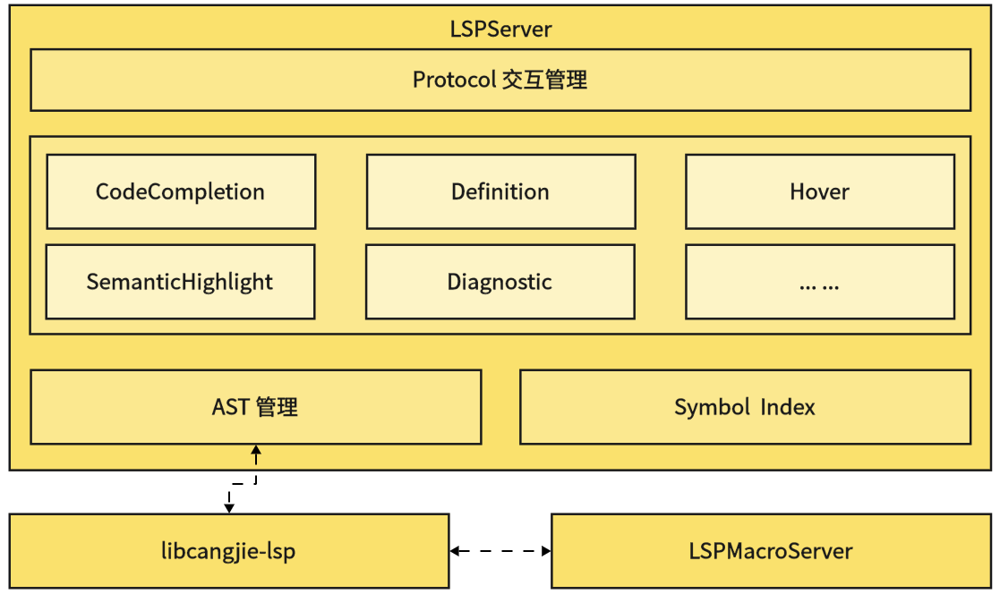

# 仓颉语言服务器开发者指南

## 开源项目介绍

该项目是一个语言服务器，支持仓颉的IDE功能。

这个工程可以编译成一个名为LSPServer的可执行文件。

系统架构图如下：



## 目录结构

```text
cangjie-language-server/
|- build          # 语言服务源码构建脚本存放文件夹
|- doc            # 语言服务开发指南和用户指南存放文件夹
|- generate       # 语言服务自定义索引结构文件存放文件夹
|  |- index.fbs   # 语言服务自定义索引结构文件
└─ src            # 语言服务源码文件夹
...
```

## 编译构建

### 构建准备

语言服务构建依赖cjc，所以在构建这个工程之前，我们应该先完成前置构建，构建方式参见[仓颉SDK集成构建指导书](https://gitcode.com/Cangjie/cangjie_build/blob/dev/README_zh.md)。更多软件依赖，参见[环境准备](https://gitcode.com/Cangjie/cangjie_build/blob/dev/docs/env_zh.md)。

### 构建步骤

1. 通过`git clone`命令获取`lsp`的最新源码：

```shell
cd ${WORKDIR}
git clone https://gitcode.com/Cangjie/cangjie_tools.git
```

2. 完成前置构建准备后，配置环境变量：

```shell
export CANGJIE_HOME=/path/to/cangjie    # (for Linux/macOS)
set CANGJIE_HOME=/path/to/cangjie       # (for Windows)
# /path/to/cangjie路径为仓颉SDK（或前置依赖cjc构建产物）路径，根据实际情况作调整。Linux交叉编译Windows场景，需要准备Windows的SDK
```

3. 通过`cangjie-language-server/build`目录下的build.py来编译项目，命令如下:

```shell
python3 build.py build -t release  # (for Linux/MacOS)
python3 build.py build -t release --target windows-x86_64  # (for Linux-to-Windows)
```

构建完成后，将在`output/bin`下生成`LSPServer`二进制。

### 运行测试用例

我们可以使用build.py来编译用于测试的项目，命令如下:

```shell
python3 build.py build -t release --test
```

构建完成后，将在`output/bin`下生成`LSPServer`和`gtest_LSPServer_test`二进制。

使用以下命令运行测试用例：

```shell
python3 build.py test
```

### 更多构建选项

`build.py`的`build`功能提供如下额外选项：

- `--target TARGET`：指定编译目标产物的运行平台，默认值为`native`，即本地平台，当前仅支持`linux`平台上通过`--target windows-x86_64`交叉编译`windows-x86_64`平台的产物；
- `-t, --build-type BUILD_TYPE`：指定构建产物版本，可选值为`debug/release/relwithdebinfo`；
- `-j, --job JOB`：指定编译时的并发度；
- `--test`：编译运行测试用例的产物；
- `-h, --help`：打印`build`功能的帮助信息。

此外，`build.py`还提供如下额外功能：

- `install [--prefix PREFIX]`：将构建产物安装到指定路径，不指定路径时默认为`cangjie-language-server/output/bin`目录，`install` 前需要先正确执行 `build`；
- `clean`：清除默认路径的构建产物；
- `test`：运行测试用例；
- `-h, --help`：打印`build.py`的帮助信息。

## 仓颉 SDK 集成构建

仓颉SDK集成构建，参见[仓颉SDK集成构建指导书](https://gitcode.com/Cangjie/cangjie_build/blob/dev/README_zh.md)。

## 相关仓

本仓为仓颉工具源码，本文档介绍的是仓颉语言服务工具，完整组件相关仓如下：

- [仓颉编译器](https://gitcode.com/Cangjie/cangjie_compiler)：提供仓颉编译器源码；
- [仓颉标准库](https://gitcode.com/Cangjie/cangjie_runtime)：提供仓颉标准库源码；
- [仓颉运行时](https://gitcode.com/Cangjie/cangjie_runtime)：提供仓颉运行时源码；
- [**仓颉工具**](https://gitcode.com/Cangjie/cangjie_tools)：提供仓颉工具套源码。
