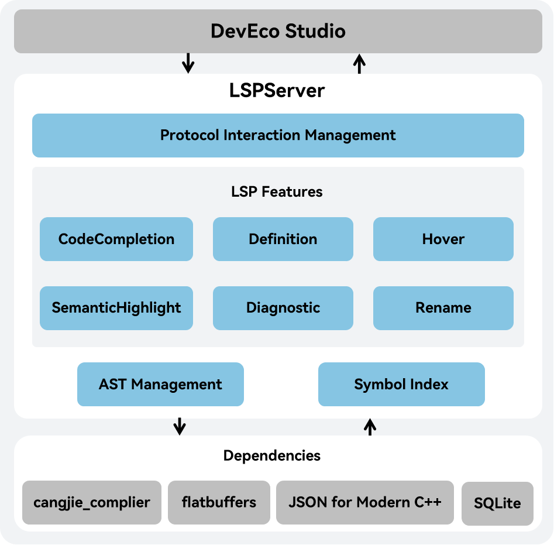

# Cangjie Language Server Developer Guide

## System Architecture

This project is a language server that provides Cangjie language support for DevEco Studio. It functions as the backend and must be used in conjunction with the DevEco Studio client.

The project can be compiled into an executable named LSPServer.

The system architecture diagram is as follows:



As shown in the architecture diagram:

Protocol Interaction Management: Implementing communication with the DevEco Studio client using the LSP protocol, including message encapsulation, message forwarding, and message processing.

LSP Features: Implements language server features such as code completion, go to definition, and semantic token highlight.
- CodeCompletion: Provides real-time Cangjie code suggestions and completion as developers write code, based on the input content.
- Definition: Allows developers to jump to the definition of a specified Cangjie code symbol, such as a class name, function name and variable name.
- Hover: Displays detailed information about the code when the developer hovers the mouse, such as the definition type and related comments
- SemanticHighlight: Applies language server syntax highlighting to Cangjie code, using different colors to distinguish various elements like class names, function names, and variables.
- Diagnostic: Errors or warnings are highlighted in the relevant code segments when the code violates Cangjie syntax or semantic rules.
- Rename: Provides a code renaming capability that automatically updates both the definition and all references of the symbol.

AST Management: Implements the construction and management of the AST.

Symbol Index: Implements the generation and modification of symbol indexes and offers search functionality.

## Directory Structure

```text
cangjie-language-server/
|-- build          # Folder containing build scripts for language service source code
|-- doc            # Folder containing developer guides and user manuals
    |-- figures    # Folder containing images used in the language service documentation
|-- generate       # Folder containing custom index structure files for language service
    |-- index.fbs  # Custom index structure file for language service
|--src             # Source code folder for language service 
    |-- json-rpc            # folder for parsing/handling the LSP protocol
    |-- languageserver      # folder for the core implementation of the language service
        |-- capabilities    # Implementation of LSP features
        |-- common          # Implementation of base functionality
        |-- index           # Implementation of indexing functionality
        |-- logger          # Implementation of logging functionality
    |-- launcher            # folder for language service startup and initialization
```

## Build Instructions

### Prerequisites

The language service build depends on cjc, so before building this project, we should first complete the prerequisite build. For build methods, refer to the [Openharmony SDK Integration Build Guide](). For additional software dependencies, see [Environment Preparation]().

### Build Steps

1. Obtain the latest LSP source code via `git clone` command:

```shell
cd ${WORKDIR}
git clone https://gitcode.com/Cangjie/cangjie_tools.git
```

2. After completing prerequisite preparations, configure environment variables:

```shell
export CANGJIE_HOME=/path/to/cangjie    # (for Linux/macOS)
set CANGJIE_HOME=/path/to/cangjie       # (for Windows)
# The /path/to/cangjie should be adjusted to the actual path of Openharmony SDK (or cjc build output). For Linux cross-compiling to Windows scenarios, the Windows SDK needs to be prepared.
```

3. Compile the project using build.py in the `cangjie-language-server/build` directory with the following command:

```shell
python3 build.py build -t release  # (for Linux/MacOS)
python3 build.py build -t release --target windows-x86_64  # (for Linux-to-Windows cross-compilation)
```

After successful build, the `LSPServer` binary will be generated under `output/bin`.

### Running Test Cases

We can use build.py to compile the project for testing with the following command:

```shell
python3 build.py build -t release --test
```

After build completion, both `LSPServer` and `gtest_LSPServer_test` binaries will be generated under `output/bin`.

Run test cases using:

```shell
python3 build.py test
```

### Additional Build Options

The `build` function of `build.py` provides the following additional options:

- `--target TARGET`: Specifies the target platform for compilation output. Default value is `native` (local platform). Currently only supports cross-compiling `windows-x86_64` platform targets from `linux` platform via `--target windows-x86_64`.
- `-t, --build-type BUILD_TYPE`: Specifies build output version type. Optional values are `debug/release/relwithdebinfo`.
- `-j, --job JOB`: Specifies compilation concurrency level.
- `--test`: Compiles output for running test cases.
- `-h, --help`: Prints help information for the `build` function.

Additionally, `build.py` provides the following extra functions:

- `install [--prefix PREFIX]`: Installs build output to specified path. Default path is `cangjie-language-server/output/bin` directory when not specified. Requires successful `build` execution first.
- `clean`: Cleans build output from default paths.
- `test`: Runs test cases.
- `-h, --help`: Prints help information for `build.py`.

## Openharmony SDK Integration Build

For Openharmony SDK integration build, refer to the [Openharmony SDK Integration Build Guide](https://gitcode.com/Cangjie/cangjie_build/blob/dev/README_zh.md).
