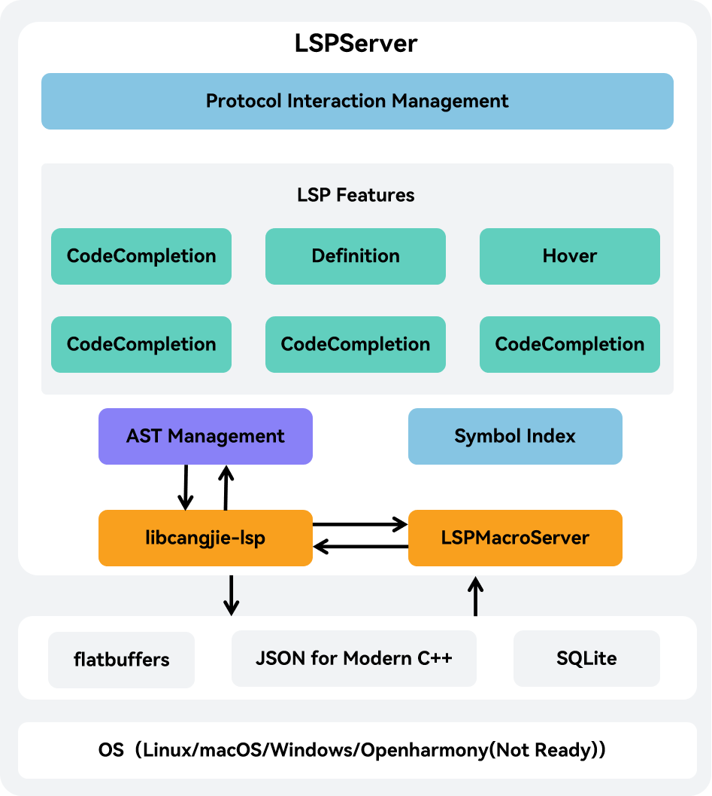

# Cangjie Language Server Developer Guide

## Open Source Project Introduction

This project is a language server that supports IDE features for Cangjie, It is a backend server and must be used in conjunction with an IDE client. Developers can utilize the VSCode extension officially released by Cangjie or develop their own IDE clients compatible with the Language Server Protocol (LSP).

The project can be compiled into an executable named LSPServer.

The system architecture diagram is as follows:



## Directory Structure

```text
cangjie-language-server/
|- build          # Folder containing build scripts for language service source code
|- doc            # Folder containing developer guides and user manuals
|- generate       # Folder containing custom index structure files for language service
|  |- index.fbs   # Custom index structure file for language service
└─ src            # Source code folder for language service
...
```

## Build Instructions

### Prerequisites

The language service build depends on cjc, so before building this project, we should first complete the prerequisite build. For build methods, refer to the [Cangjie SDK Integration Build Guide](). For additional software dependencies, see [Environment Preparation]().

### Build Steps

1. Obtain the latest LSP source code via `git clone` command:

```shell
cd ${WORKDIR}
git clone https://gitcode.com/Cangjie/cangjie_tools.git
```

2. After completing prerequisite preparations, configure environment variables:

```shell
export CANGJIE_HOME=/path/to/cangjie    # (for Linux/macOS)
set CANGJIE_HOME=/path/to/cangjie       # (for Windows)
# The /path/to/cangjie should be adjusted to the actual path of Cangjie SDK (or cjc build output). For Linux cross-compiling to Windows scenarios, the Windows SDK needs to be prepared.
```

3. Compile the project using build.py in the `cangjie-language-server/build` directory with the following command:

```shell
python3 build.py build -t release  # (for Linux/MacOS)
python3 build.py build -t release --target windows-x86_64  # (for Linux-to-Windows cross-compilation)
```

After successful build, the `LSPServer` binary will be generated under `output/bin`.

### Running Test Cases

We can use build.py to compile the project for testing with the following command:

```shell
python3 build.py build -t release --test
```

After build completion, both `LSPServer` and `gtest_LSPServer_test` binaries will be generated under `output/bin`.

Run test cases using:

```shell
python3 build.py test
```

### Additional Build Options

The `build` function of `build.py` provides the following additional options:

- `--target TARGET`: Specifies the target platform for compilation output. Default value is `native` (local platform). Currently only supports cross-compiling `windows-x86_64` platform targets from `linux` platform via `--target windows-x86_64`.
- `-t, --build-type BUILD_TYPE`: Specifies build output version type. Optional values are `debug/release/relwithdebinfo`.
- `-j, --job JOB`: Specifies compilation concurrency level.
- `--test`: Compiles output for running test cases.
- `-h, --help`: Prints help information for the `build` function.

Additionally, `build.py` provides the following extra functions:

- `install [--prefix PREFIX]`: Installs build output to specified path. Default path is `cangjie-language-server/output/bin` directory when not specified. Requires successful `build` execution first.
- `clean`: Cleans build output from default paths.
- `test`: Runs test cases.
- `-h, --help`: Prints help information for `build.py`.

## Cangjie SDK Integration Build

For Cangjie SDK integration build, refer to the [Cangjie SDK Integration Build Guide](https://gitcode.com/Cangjie/cangjie_build/blob/main/README_zh.md).

## Related Repositories

This repository contains Cangjie tool source code. This document introduces the Cangjie language service tool. The complete component-related repositories are as follows:

- [Cangjie Compiler](https://gitcode.com/Cangjie/cangjie_compiler): Provides Cangjie compiler source code.
- [Cangjie Standard Library](https://gitcode.com/Cangjie/cangjie_runtime): Provides Cangjie standard library source code.
- [Cangjie Runtime](https://gitcode.com/Cangjie/cangjie_runtime): Provides Cangjie runtime source code.
- [**Cangjie Tools**](https://gitcode.com/Cangjie/cangjie_tools): Provides Cangjie tool suite source code.