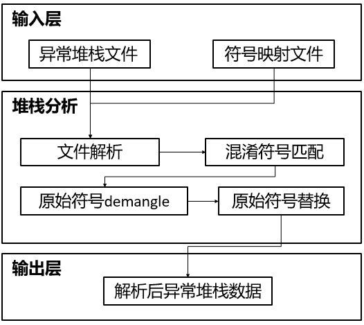

# 异常堆栈信息还原工具开发指南

## 开源项目介绍

`cjtrace-recover` 是仓颉语言的异常堆栈信息还原工具。如果开发者在编译仓颉应用时开启了外形混淆，那么仓颉应用在运行时如果遇到问题，抛出的异常信息中的堆栈信息也是被混淆的状态，这导致开发者难以定位问题发生原因。`cjtrace-recover` 可以帮助开发者还原混淆过的异常堆栈信息，从而更好地定位和排查问题原因。具体来说，`cjtrace-recover` 可以还原异常堆栈信息中的以下两种信息：

- 被混淆的函数名
- 被混淆的路径名

其整体技术架构如图所示：



## 目录

`cjtrace-recover` 源码目录如下所示，其主要功能如注释中所描述。

```
cjtrace-recover/src
|-- cjtrace-recover.cj			# cjtrace-recover 命令行功能代码
`-- native						# 调用的 C 接口的代码目录
    `-- DemangleWrapper.cpp		# 调用 demangle 的桥接代码
```

## 安装和使用指导

## 安装和使用指导

### 构建准备

`cjtrace-recover` 需要以下工具来构建：

- `clang` 或者 `gcc` 编译器
- `cmake` 3.16.3 及以上版本
- `Ninja` 构建工具
- `cangjie SDK`
    - 开发者需要下载对应平台的 `cangjie SDK`：若想要编译本地平台产物，则需要的 `SDK` 为当前平台对应的版本；若想要从 `Linux` 平台交叉编译获取 `Windows` 平台的产物，则需要的 `SDK` 为 `Linux` 版本。
    - 开发者需要执行对应 `cangjie SDK` 的 `envsetup` 脚本，确保 `SDK` 被正确配置。开发者也可以使用 `build.py` 的 `--cangjie-sdk` 指定要使用的 `cangjie SDK`。
- 若使用 `build.py` 进行构建，请安装 `python3`
- （可选）若使用 `Linux` 交叉编译 `Windows` 平台工具时，需要 `mingw` 工具链

### 构建步骤

开发者可以使用 `build` 目录下的构建脚本 `build.py` 进行 `cjtrace-recover` 构建。若想使用 `build.py` 构建，开发者可以配置 `cangjie SDK`，也可以使用自行编译的 `cangjie SDK`。若需要使用自行编译的 `cangjie SDK`，请参阅 [cangjie SDK 构建文档](https://gitcode.com/Cangjie/cangjie_build) 了解源码编译 `cangjie SDK` 的方法。

构建流程如下：

1. 通过 `cjtrace-recover/build` 目录下的构建脚本 `build.py` 编译 `cjtrace-recover`：

    ```shell
    cd ${WORKDIR}/cangjie-tools/cjtrace-recover/build
    python3 build.py build -t release                                                                  (for Linux/Windows/macOS)
    python3 build.py build -t release --target windows-x86_64 --target-sysroot <mingw toolchain path>  (for Linux-to-Windows)
    ```

    开发者需要通过 `-t, --build-type` 指定构建产物版本，该值会透传给 cmake 构建工程，可选值为 `debug/release/minsizerel/relwithdebinfo/minsizerelwithdebinfo`。

    开发者可以使用 `--prefix` 命令声明构建安装路径，默认值为 `/usr/local`（继承自 cmake）。

2. 验证 `cjtrace-recover` 是否安装成功：

    ```shell
    cjtrace-recover -h
    ```

    如果输出 `cjtrace-recover` 的帮助信息，则表示安装成功。

> **注意：**
>
> `Linux/macOS` 系统中，开发者可以将 `boundscheck` 动态库的路径配置到 `rpath` 中，以使编译出来的 `cjtrace-recover` 可以不通过系统动态库环境变量就能找到 `boundscheck` 动态库：
> - 使用构建脚本 `build.py` 编译时，可以通过添加参数 `--set-rpath RPATH` 配置 `rpath` 的路径。
> - `cangjie SDK` 中，`boundscheck` 动态库目录位于 `$CANGJIE_HOME/runtime/lib` 目录，基于运行平台划分成若干子目录，可以使用对应运行平台的库目录用于配置 `rpath`。

### 更多构建选项

`build.py` 的 `build` 功能提供如下额外选项：
- `-t, --build-type BUILD_TYPE`: 指定构建产物版本，可选值为 `debug/release/minsizerel/relwithdebinfo/minsizerelwithdebinfo`；
- `--target TARGET`: 指定编译目标产物的运行平台，默认值为空，即本地平台，当前仅支持 `linux` 平台上通过 `--target windows-x86_64` 交叉编译 `windows-x86_64` 平台的产物；
- `--set-rpath RPATH`: 指定 `rpath` 路径；
- `--target-sysroot PATH`: 指定交叉编译的工具链路径，若使用 `Linux` 交叉编译 `Windows` 平台工具时必选。
- `--prefix`: 将构建产物安装到指定路径。`build` 功能和 `install` 功能中的 `--prefix` 选项用途一致，开发者任选其一即可声明构建安装路径。
- `--cangjie-sdk`：指定使用的 `cangjie SDK`。开发者若已经使用了 `cangjie SDK` 的 `envsetup` 脚本，则可以不使用该选项。
- `-h, --help`: 打印 `build` 功能的帮助信息。

此外，`build.py` 还提供如下额外功能：

- `install [--prefix PREFIX]`: 将构建产物安装到指定路径，不指定路径时默认值为 `/usr/local` 目录；`install` 前需要先正确执行 `build`；
- `clean`: 清除默认路径的构建产物；
- `-h, --help`: 打印 `build.py` 的帮助信息。

## API 和配置说明

`cjcov` 提供以下主要命令，用于项目构建和配置管理。

### 命令介绍

通过 `cjtrace-recover -h` 即可查看命令使用方法：

```text
cjtrace-recover -h
Usage: cjtrace-recover OPTION

Use symbol mapping files to recover obfuscated exception stacktrace. The supported options are:
    -f <file>       path to the obfuscated exception stacktrace file
    -m <file,...>   path to the symbol mapping files
    -h              display this help and exit
    -v              print version of cjtrace-recover
```

开发者可以通过 `-f` 选项指定异常堆栈信息保存的文件，通过 `-m` 选项指定符号映射文件，`cjtrace-recover` 会根据符号映射文件中的映射关系还原异常堆栈信息中的符号名和路径名，并将还原后的异常堆栈信息通过标准输出（`stdout`）输出。

### 使用样例

假设有经过外形混淆的仓颉程序抛出的异常堆栈信息如下：

```text
An exception has occurred:
MyException: this is myexception
     at a0(SOURCE:0)
     at ah(SOURCE:0)
     at c3(SOURCE:0)
     at cm0(SOURCE:0)
     at cm1(SOURCE:0)
     at ci0(:0)
```

并且在混淆编译时输出的符号映射文件 `test.obf.map` 的内容如下：

```text
_ZN10mymod.mod111MyException6<init>ER_ZN8std.core6StringE a0 mymod/mod1/mod1.cj
_ZN10mymod.mod115my_common_func1Ev ah mymod/mod1/mod1.cj
_ZN10mymod.mod18MyClassA7myfunc1Eld c3 mymod/mod1/mod1.cj
_ZN7default6<main>Ev cm0 test1/test.cj
user.main cm1
cj_entry$ ci0
```

开发者需要将异常堆栈信息保存在文件中，假设为 `test_stacktrace`。然后通过以下指令还原异常堆栈信息：

```shell
cjtrace-recover -f test_stacktrace -m test.obf.map
```

运行该指令后，会得到如下输出：

```text
An exception has occurred:
MyException: this is myexception
     at mymod.mod1.MyException::init(std.core::String)(mymod/mod1/mod1.cj)
     at mymod.mod1.my_common_func1()(mymod/mod1/mod1.cj)
     at mymod.mod1.MyClassA::myfunc1(Int64, Float64)(mymod/mod1/mod1.cj)
     at default.main()(/home/zzx/repos/obf_test/test1/test.cj)
```

`cjtrace-recover` 会根据符号映射文件还原异常堆栈信息，并通过标准输出流（`stdout`）输出。
