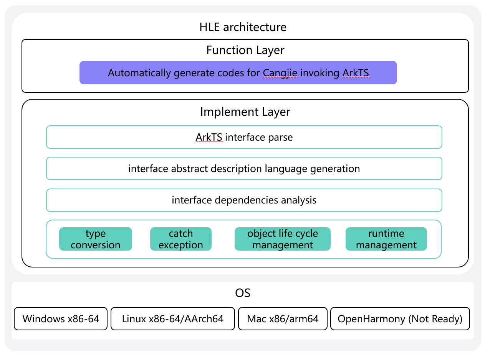

# HLE Tool Development Guide

## System Architecture

`HLE (HyperlangExtension)` is an automated code template generation tool for Cangjie-ArkTS interoperability.
The input of this tool is ArkTS interface declaration files, such as files ending with .d.ts or .d.ets. The output includes a BUILD.gn file and a src folder. The src folder contains cj files where the generated interoperability code is stored. The tool also outputs a json file containing all information of the ArkTS files. To improve the ease of interoperability, DevEco Studio provides two tools: one is the ArkTS-to-Cangjie Bindings generator, which automatically generates code for ArkTS calling Cangjie and interface files on the ArkTS side through the @Interop macro expansion, and the other is the Cangjie-to-ArkTS Bindings generator (also known as the HLE tool). The overall technical architecture is shown in the figure below.




- ArkTS Language Interface Parsing: Parses the input ArkTS interface declaration file, extracting various information about the interface, such as definition, parameters, return values, etc. This provides the basic interface metadata for subsequent generation of interoperability code, serving as the starting parsing step of the entire code generation process.

- Tool parameter analysis: parse each parameter of the input command.
- Interface Abstract Description Generation: Based on the parsed ArkTS interface, the interface information is abstracted to create a unified and concise abstract description of the interface, facilitating subsequent operations like interface dependency analysis, and providing a clear abstract model for handling interface relations during the code generation process.
- Interface Dependency Analysis: Analyzes the dependency relationships between various ArkTS interfaces, clarifying the order of calls, dependency conditions, etc., ensuring that the generated interoperability code is logically correct, can properly handle dependencies between interfaces, and guarantees the executability of the code.
- Code generation: Automatically produces Cangjie wrapper layer code based on the interoperability library.

Explanation of component dependencies in the architecture diagram:

- cangjie_compiler: Provides the capability to compile and build HLE tools.
- cangjie_stdx: Provides the capability to parse JSON libraries; HLE tools use JSON as an intermediate parsing language.

## Directory Structure

The source code directory of `HLE` is structured as follows, with main functionalities described in the comments:

```
hyperlangExtension/
|-- build                       # Build scripts
|-- doc                         # Documentation
|-- src                         # Source code
    |-- dtsparser               # Parsing ArkTS interface files and generating intermediate JSON descriptions
    |-- entry                   # Tool parameter analysis and saving
    |-- tool                    # ArkTS interface to Cangjie code generator
|-- tests                       # Test cases
```

## Installation and Usage Guide:

### Build Preparation

Below is a build guide for Ubuntu 22 environment.

1. Download and extract the latest Cangjie package, then configure the Cangjie environment:

`HLE` requires the following tools for building:

- `Openharmony SDK`
    - Developers need to download the `Openharmony SDK` for the target platform: For compiling native platform artifacts, use the SDK version matching the current platform; for cross-compiling Windows artifacts from Linux, use the Linux version of the SDK.
    - Then, execute the `envsetup` script of the corresponding SDK to ensure proper configuration.
- `stdx` binary library compatible with `Openharmony SDK`
    - Developers need to download the `stdx` binary library for the target platform or compile it from `stdx` source code: To compile native platform artifacts, the `stdx` library must match the current platform; to cross-compile `Windows` platform artifacts from a `Linux` platform, the `stdx` library must be the `Windows` version.
    - Then, developers must configure the `stdx` binary library path in the environment variable `CANGJIE_STDX_PATH`. If downloading pre-built `stdx` binaries, the path is the `static/stdx` directory under the extracted library directory; if compiling from `stdx` source, the path is the `static/stdx` directory under the corresponding platform directory in the `target` output directory (e.g., `target/linux_x86_64_cjnative/static/stdx` for `Linux-x86`). Refer to [stdx Repository](https://gitcode.com/Cangjie/cangjie_stdx) for compiling `stdx` from source.
    - Additionally, if developers want to use `stdx` dynamic libraries as binary dependencies, they can replace `static` with `dynamic` in the above path configuration. `HLE` compiled this way cannot run independently; to enable standalone execution, the same `stdx` library path must be added to the system dynamic library environment variables.
- For building with `python` scripts, install `python3`.

2. This tool requires Node.js for execution:

    Recommended version: v18.14.1 or higher. Lower versions may fail to parse certain ArkTS syntax, so using the latest version is advised.

    [How to Install Node.js](https://dev.nodejs.cn/learn/how-to-install-nodejs/)

    For example, use the following commands:

    ```sh
    # Download and install nvm:
    curl -o- https://raw.githubusercontent.com/nvm-sh/nvm/v0.40.3/install.sh | bash
    # in lieu of restarting the shell
    \. "$HOME/.nvm/nvm.sh"
    # Download and install Node.js:
    nvm install 22
    # Verify the Node.js version:
    node -v # Should print "v22.17.1".
    nvm current # Should print "v22.17.1".
    # Verify npm version:
    npm -v # Should print "10.9.2".
    ```

### Build Steps

1. Clone this project:

    ```sh
    git clone https://gitcode.com/Cangjie/cangjie_tools.git
    ```

2. Install dependencies:

    Install TypeScript dependencies, which include the TypeScript compiler, by running:

    ```sh
    cd {WORKDIR}/cangjie-tools/hyperlangExtension/src/dtsparser
    npm install
    ```

3. Compile `hle` using the build script in `hyperlangExtension/build`:

    ```shell
    cd cangjie-tools/hyperlangExtension/build
    python3 build.py build -t release
    ```

    Currently supported build types are `debug` and `release`, specified via `-t` or `--build-type`.

4. Install to a specified directory:

    ```shell
    python3 build.py install
    ```

    By default, this installs to `hyperlangExtension/target`. Use the `--prefix` parameter to specify an alternative directory:

    ```shell
    python3 build.py install --prefix ./output
    ```

    The output directory structure is:

    ```
    output/
    |-- hle                         # Executable (hle.exe on Windows)
    ```

5. Verify `hle` installation:

    ```shell
    ./hle -h
    ```

    Execute this in the installation directory. If the help information for `hle` is displayed, the installation is successful.

    To use the binary file directly:

    ```sh
    ${WORKDIR}/cangjie-tools/hyperlangExtension/output/hle -i input_file_path -o output_folder --lib
    ```

    Example:

    ```sh
    ${WORKDIR}/cangjie-tools/hyperlangExtension/output/hle  -i  ${WORKDIR}/cangjie-tools/hyperlangExtension/tests/cases/class.d.ts -o out --module-name=ohos.hilog --lib
    ```

    On Windows, file paths must use forward slashes (`/`) instead of backslashes (`\`):
    ```sh
    ${WORKDIR}/cangjie-tools/hyperlangExtension/output/hle.exe -i  ${WORKDIR}/cangjie-tools/hyperlangExtension/tests/cases/class.d.ts -o out --module-name=ohos.hilog --lib
    ```

6. Clean build artifacts:

   ```shell
   python3 build.py clean
   ```

Cross-compiling `hle` for Windows from Linux is also supported:

```shell
export CANGJIE_HOME=${WORKDIR}/cangjie
python3 build.py build --target windows-x86_64
python3 build.py install --prefix output
```

The build artifacts will be located in `hyperlangExtension/output`.

### Additional Build Options

`build.py` provides the following additional options for the `build` command:
- `--target TARGET`: Specify the target platform (default: `native`). Currently, only cross-compiling `windows-x86_64` artifacts from `linux` is supported via `--target windows-x86_64`;
- `-t, --build-type BUILD_TYPE`: Specify build type (`debug` or `release`);
- `-h, --help`: Display help information for the `build` command.

Other `build.py` functionalities include:

- `install [--prefix PREFIX]`: Install build artifacts to a specified path (default: `hyperlangExtension/target/`). Requires successful `build` execution first;
- `clean`: Remove build artifacts from the default path;
- `-h, --help`: Display general help information for `build.py`.

### Command Reference

Usage: `hle [option] file [option] file`

`hle -h` displays help information and options:

```text
Usage: main [options]

Description:
    This tool is designed to generate cangjie bindings for .d.ts or .d.ets files.

Options:
  -i <file>             The absolute path of the input d.ts or d.ets file (required if -d is not used)
  -r <file>             The absolute path of the typescript compiler source code
  -d <directory>        The absolute path of the directory containing d.ts or d.ets file (required if -i is not used)
  -o <directory>        The directory to save the binding code (optional, defaults to the current directory)
  -j <file>             The absolute path of the d.ts or d.ets file analyzer (optional)
  --module-name <name>  Customize the generated Cangjie package name (optional)
  --lib                 Generate bindings for third-party library (optional)
  --help                Display this help information
```

### Test Case Validation

Execute test cases with the following command. Output will be saved in `./tests/expected/my_module/`, and users should verify if it meets expectations.

```bash
${WORKDIR}/cangjie-tools/hyperlangExtension/output/hle--lib --module-name="my_module" -d ./tests/cases -o ./tests/expected/my_module/
```
