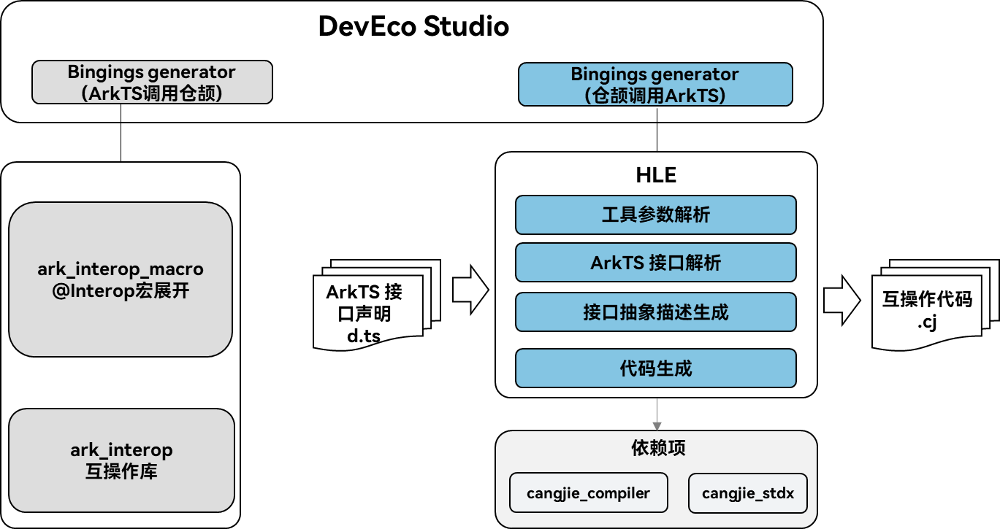

# HLE工具开发指南

## 系统架构

`HLE (HyperlangExtension)` 是一个仓颉调用ArkTS互操作代码模板自动生成工具。
该工具的输入是ArkTS接口声明文件，例如后缀.d.ts或者.d.ets结尾的文件，输出为包含BUILD.gn文件和src文件夹。src文件夹中包含的cj文件中存放生成的互操作代码。工具也会输出包含ArkTS文件的所有信息的json文件。为了提升互操作易用性，在DevEco Studio提供了两个工具，一个是ArkTS调用仓颉的Bindings generator，即通过@Interop宏展开，自动生产ArkTS调用仓颉的代码和ArkTS侧的接口文件，另外一个工具是仓颉调用ArkTS的Bindings generator(即HLE工具)，其整体技术架构如下图所示：



- 工具参数解析：对输入的命令行参数进行解析。
- ArkTS语言接口解析：对输入的 ArkTS 接口声明文件进行解析，提取其中关于接口的各种信息，比如接口的定义、参数、返回值等，为后续生成互操作代码提供基础的接口元数据，是整个代码生成流程的起始解析步骤。

- 接口抽象描述生成：在解析 ArkTS 接口的基础上，将接口信息进行抽象化处理，生成统一、简洁的接口抽象描述，便于后续进行接口依赖分析等操作，为代码生成过程中对接口关系的处理提供清晰的抽象模型。

- 代码生成：基于互操作库，自动生产仓颉封装层代码。

架构图中依赖部件引入说明：

- cangjie_compiler: 提供编译构建HLE工具的能力。
- cangjie_stdx: 提供JSON库的解析的能力，HLE工具使用JSON语言作为中间解析语言。


## 目录

`HLE` 源码目录如下图所示，其主要功能如注释中所描述。

```
hyperlangExtension/
|-- build                       # 构建脚本
|-- doc                         # 介绍文档
|-- src                         # 源码文件
    |-- dtsparser               # ArkTS接口文件解析和生成中间层JSON描述
    |-- entry                   # 工具参数解析和保存
    |-- tool                    # ArkTS接口转换为仓颉接口
|-- tests                       # 测试用例
```

## 安装和使用指导：

### 构建准备

以下是一个ubuntu22环境下的构建指导。

1. 下载并解压最新仓颉包，配置仓颉环境：

`HLE` 需要以下工具来构建：

- `Openharmony SDK`
    - 开发者需要下载对应平台的 `Openharmony SDK`：若想要编译本地平台产物，则需要的 `SDK` 为当前平台对应的版本；若想要从 `Linux` 平台交叉编译获取 `Windows` 平台的产物，则需要的 `SDK` 为 `Linux` 版本。
    - 然后，开发者需要执行对应 `SDK` 的 `envsetup` 脚本，确保 `SDK` 被正确配置。
- 与 `Openharmony SDK` 配套的 `cangjie stdx` 二进制库
    - 开发者需要下载目标平台的 `stdx` 二进制库，或通过 `stdx` 源码编译出对应的 `stdx` 二进制库：若想要编译本地平台产物，则需要的 `stdx` 库为当前平台对应的版本；若想要从 `Linux` 平台交叉编译获取 `Windows` 平台的产物，则需要的 `stdx` 库为 `Windows` 版本。
    - 然后，开发者需要将 `stdx` 二进制库路径配置到环境变量 `CANGJIE_STDX_PATH` 中。若开发者直接下载 `stdx` 二进制库，则路径为解压得到的库目录下的 `static/stdx` 目录；若开发者通过 `stdx` 源码编译，则路径为 `stdx` 编译产物目录 `target` 下对应平台目录下的 `static/stdx` 目录，例如 `Linux-x86` 下为 `target/linux_x86_64_cjnative/static/stdx`。请参阅 [stdx 仓](https://gitcode.com/Cangjie/cangjie_stdx) 获取源码编译 `stdx` 库的方法。
    - 此外，如果开发者想使用 `stdx` 动态库作为二进制库依赖，可以将上述路径配置中的 `static` 改为 `dynamic`。以此方式编译的 `HLE` 无法独立运行，若想让其能够独立运行，需要将相同的 `stdx` 库路径配置到系统动态库环境变量中。
- 使用 `python` 构建脚本方式编译，请安装 `python3`。

2. 本工具执行依赖nodejs：

    版本建议在v18.14.1及以上, 低版本可能存在ArkTS语法无法解析情况，建议使用新版本node。

    [如何安装 Node.js](https://dev.nodejs.cn/learn/how-to-install-nodejs/)

    比如可以使用以下的命令安装：
    
    ```sh
    # Download and install nvm:
    curl -o- https://raw.githubusercontent.com/nvm-sh/nvm/v0.40.3/install.sh | bash
    # in lieu of restarting the shell
    \. "$HOME/.nvm/nvm.sh"
    # Download and install Node.js:
    nvm install 22
    # Verify the Node.js version:
    node -v # Should print "v22.17.1".
    nvm current # Should print "v22.17.1".
    # Verify npm version:
    npm -v # Should print "10.9.2".
    ```

### 构建步骤

1. 克隆本项目：

    ```sh
    git clone https://gitcode.com/Cangjie/cangjie_tools.git
    ```

2. 安装依赖：

    需要安装typescript依赖，里面包含typescript编译器，可以执行下列代码安装依赖

    ```sh
    cd {WORKDIR}/cangjie-tools/hyperlangExtension/src/dtsparser
    npm install
    ```

3. 通过 `hyperlangExtension/build` 目录下的构建脚本编译 `hle`：

    ```shell
    cd cangjie-tools/hyperlangExtension/build
    python3 build.py build -t release
    ```

    当前支持 `debug`、`release` 两种编译类型，开发者需要通过 `-t` 或者 `--build-type` 指定。

4. 安装到指定目录：

    ```shell
    python3 build.py install
    ```

    默认安装到 `hyperlangExtension/target` 目录下，支持开发者通过 `install` 命令的参数 `--prefix` 指定安装目录：

    ```shell
    python3 build.py install --prefix ./output
    ```

    编译产物目录结构为:

    ```
    output/
    |-- hle                         # 可执行文件，Windows 中为 hle.exe
    ```

5. 验证 `hle` 是否安装成功：

    ```shell
    ./hle -h
    ```

    开发者进入安装路径的目录下执行上述操作，如果输出 `hle` 的帮助信息，则表示安装成功。

    在获取二进制文件后，直接使用命令行执行：

    ```sh
    ${WORKDIR}/cangjie-tools/hyperlangExtension/output/hle -i 输入文件路径 -o 输出文件夹 --lib
    ```

    例如：

    ```sh
    ${WORKDIR}/cangjie-tools/hyperlangExtension/output/hle  -i  ${WORKDIR}/cangjie-tools/hyperlangExtension/tests/cases/class.d.ts -o out --module-name=ohos.hilog --lib
    ```

    在Windows环境，文件目录当前不支持符号“\\”，仅支持使用“/”。
    ```sh
    ${WORKDIR}/cangjie-tools/hyperlangExtension/output/hle.exe -i  ${WORKDIR}/cangjie-tools/hyperlangExtension/tests/cases/class.d.ts -o out --module-name=ohos.hilog --lib
    ```

6. 清理编译中间产物：

   ```shell
   python3 build.py clean
   ```

当前同样支持 `Linux` 平台交叉编译 `Windows` 下运行的 `hle` 产物，构建指令如下：

```shell
export CANGJIE_HOME=${WORKDIR}/cangjie
python3 build.py build --target windows-x86_64
python3 build.py install --prefix output
```

执行该命令后，构建产物默认位于 `hyperlangExtension/output` 目录下。

### 更多构建选项

`build.py` 的 `build` 功能提供如下额外选项：
- `--target TARGET`: 指定编译目标产物的运行平台，默认值为 `native`，即本地平台，当前仅支持 `linux` 平台上通过 `--target windows-x86_64` 交叉编译 `windows-x86_64` 平台的产物；
- `-t, --build-type BUILD_TYPE`: 指定构建产物版本，可选值为 `debug/release`；
- `-h, --help`: 打印 `build` 功能的帮助信息。

此外，`build.py` 还提供如下额外功能：

- `install [--prefix PREFIX]`: 将构建产物安装到指定路径，不指定路径时默认为 `hyperlangExtension/target/` 目录；`install` 前需要先正确执行 `build`；
- `clean`: 清除默认路径的构建产物；
- `-h, --help`: 打印 `build.py` 的帮助信息。

### 命令介绍

使用命令行操作 `hle [option] file [option] file`

`hle -h` 帮助信息，选项介绍

```text
Usage: main [options]

Description:
    This tool is designed to generate cangjie bindings for .d.ts or .d.ets files.

Options:
  -i <file>             The absolute path of the input d.ts or d.ets file (required if -d is not used)
  -r <file>             The absolute path of the typescript compiler source code
  -d <directory>        The absolute path of the directory containing d.ts or d.ets file (required if -i is not used)
  -o <directory>        The directory to save the binding code (optional, defaults to the current directory)
  -j <file>             The absolute path of the d.ts or d.ets file analyzer (optional)
  --module-name <name>  Customize the generated Cangjie package name (optional)
  --lib                 Generate bindings for third-party library (optional)
  --help                Display this help information
```

### 测试用例验证

通过以下命令执行测试用例，执行该命令后，测试用例结果会输出在 `./tests/expected/my_module/` ，用户需要判断输出是否符合预期。

```bash
${WORKDIR}/cangjie-tools/hyperlangExtension/output/hle--lib --module-name="my_module" -d ./tests/cases -o ./tests/expected/my_module/
```
